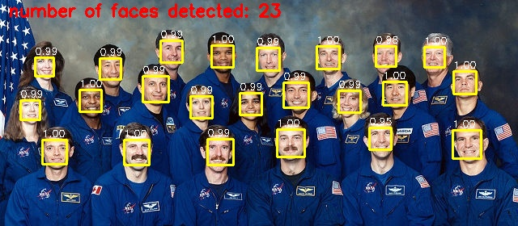
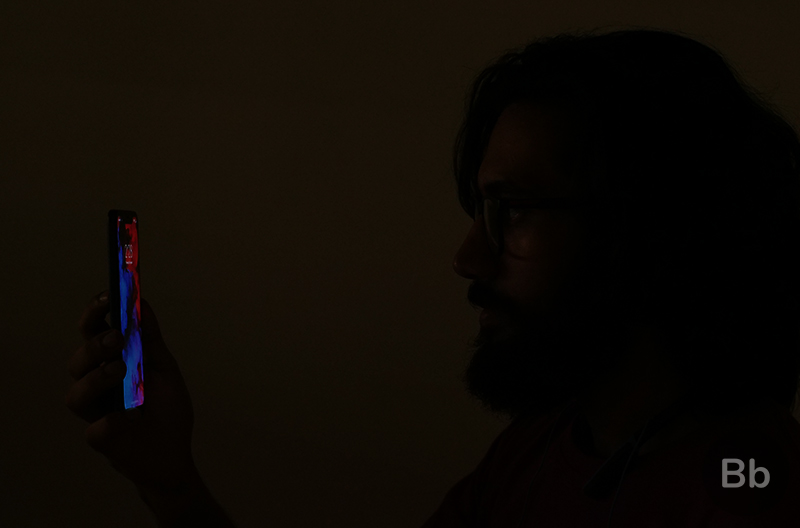
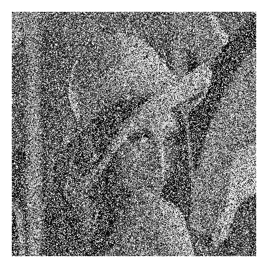
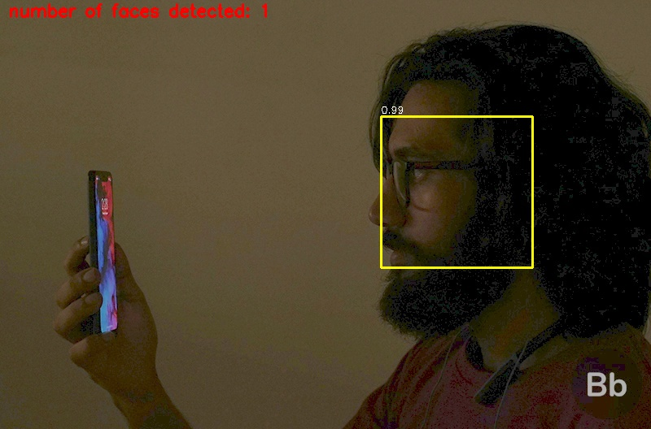
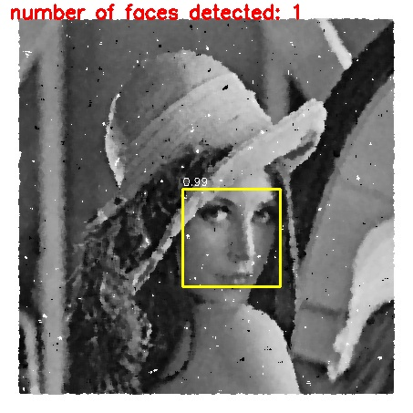

# FACE DETECTION SYSTEM

##### Deep learning based Face detection using the YOLOv3 algorithm - **with image processing capabilities**

## Introduction

We have used WIDER dataset for training our YOLOFace model. We are providing a pre-trained model under _model-weights/yolov3-wider_16000.weights_, but you can train your own model too.

**We have added Image processing techniques to enhance face-detection capabilities under unfavourable conditions**

## Example output - simple detection

>**Simple face detection**



## Adding image processing capabilities

We have added image processing capabilities to detect face under unfavourable conditions. They include:

* Dark and low-light image
* Noisy image
* Blurred images

### Sample outputs

>**Before image processing**





>**After image processing**






## Prerequisites

* Tensorflow
* opencv-python
* opencv-contrib-python
* Numpy
* Keras
* Matplotlib
* Pillow


There are many ways to install `virtual environment (virtualenv)`, see the [Python Virtual Environments: A Primer](https://realpython.com/python-virtual-environments-a-primer/) guide for different platforms, but here are a couple:

- For Ubuntu
```bash
$ pip install virtualenv
```

- For Mac
```bash
$ pip install --upgrade virtualenv
```

Create a Python 3.6 virtual environment for this project and activate the virtualenv:
```bash
$ virtualenv -p python3.6 yoloface
$ source ./yoloface/bin/activate
```

Next, install the dependencies for the this project:
```bash
$ pip install -r requirements.txt
```

# Usage

* Clone this repository
```bash
$ git clone https://github.com/rajaabhaysingh/FaceDetection
```
For face detection, you should download the pre-trained YOLOv3 weights file which trained on the WIDER FACE: A Face Detection Benchmark dataset from this link (https://drive.google.com/file/d/1xYasjU52whXMLT5MtF7RCPQkV66993oR/view?usp=sharing) and place it in the model-weights/ directory.

* Run the following command:

>**Simple image input**
```bash
$ python yoloface.py --image samples/nasa.jpg --output-dir outputs/ --imperfection none
```

>**Defective image input**
```bash
$ python yoloface.py --image samples/noise.jpg --output-dir outputs/ --imperfection noise

OR

$ python yoloface.py --image samples/low_light2.jpg --output-dir outputs/ --imperfection low_light
```

>**video input**
```bash
$ python yoloface.py --video samples/video.mp4 --output-dir outputs/
```


## References

YOLOFace-(v3)

## TEAM
* Raja Abhay Singh
* Sowmya
* Manjju Shree
* Siri
